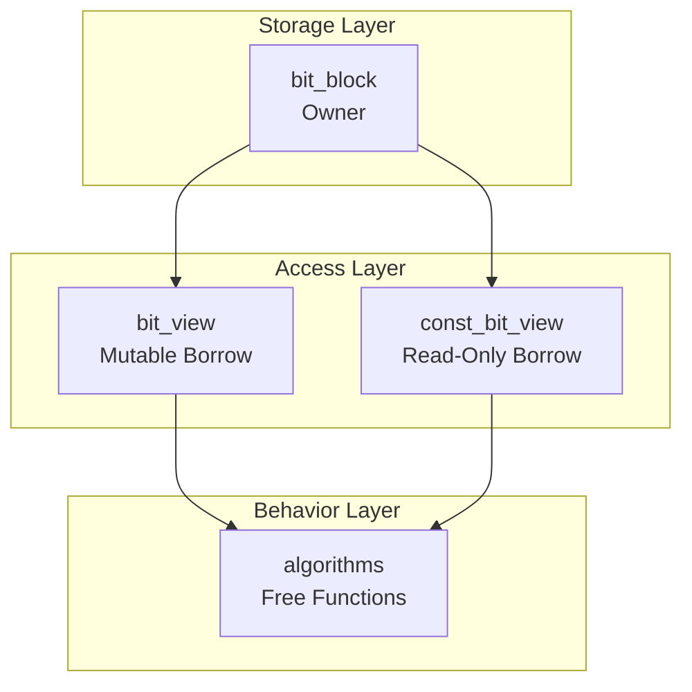

# Bit Mental Model

Understanding BitCal requires first establishing a correct mental model for bit operations.

## Memory Perspective

In computer memory, bits are organized in **words**. BitCal uses 64-bit words as the base unit:

```
┌──────────────────────────────────────────────────────────────────┐
│                         64-bit Word                               │
├──┬──┬──┬──┬──┬──┬──┬──┬──┬──┬──┬──┬──┬──┬──┬──┬──┬──┬──┬──┬──┬──┤
│63│62│61│60│59│58│57│56│55│54│53│52│51│50│49│48│...│ 3│ 2│ 1│ 0│
└──┴──┴──┴──┴──┴──┴──┴──┴──┴──┴──┴──┴──┴──┴──┴──┴──┴──┴──┴──┴──┴──┘
│<────────────────── Little-endian: LSB at lower address ───────────>│
```

### Little-Endian

BitCal follows little-endian convention:
- Bit 0 is the least significant bit (LSB)
- Bit 63 is the most significant bit (MSB)
- Word 0 is stored at the lowest memory address

## Width Selection

BitCal supports the following fixed widths:

| Type | Width | Words | Typical Use |
|------|-------|-------|-------------|
| `bit_block<64>` | 64 | 1 | Scalar operations |
| `bit_block<128>` | 128 | 2 | SSE/SIMD |
| `bit_block<256>` | 256 | 4 | AVX2 |
| `bit_block<512>` | 512 | 8 | AVX-512 |
| `bit_block<1024>` | 1024 | 16 | Large bitmaps |

## Operation Categories

Bit operations can be classified into the following categories:

### Bitwise Logical Operations

```cpp
// AND: Result is 1 when both bits are 1
result = a & b;

// OR: Result is 1 when either bit is 1
result = a | b;

// XOR: Result is 1 when bits differ
result = a ^ b;

// NOT: Bit inversion
result = ~a;
```

### Shift Operations

```cpp
// Left shift: High bits discarded, low bits filled with 0
result = a << n;

// Right shift: Low bits discarded, high bits filled with 0 (logical)
result = a >> n;
```

### Bit Counting Operations

```cpp
// popcount: Count the number of 1s
count = popcount(a);

// CLZ (Count Leading Zeros): Count leading zeros
zeros = clz(a);

// CTZ (Count Trailing Zeros): Count trailing zeros
zeros = ctz(a);
```

## Three-Role Model

BitCal's core mental model is the **owner, view, algorithm** role separation:



### Why Separate?

1. **Clear Ownership**: `bit_block` owns storage, `bit_view` only borrows
2. **Zero-copy Operations**: Algorithms can operate directly on existing storage
3. **Stable Contract**: Public API centers on observable behavior, not implementation details

## Performance Intuition

Understanding SIMD performance requires building the following intuition:

### Scalar vs SIMD

| Operation | Scalar Cycles | AVX2 Cycles | Speedup |
|-----------|--------------|-------------|---------|
| 256-bit AND | 4 | 1 | 4x |
| 256-bit popcount | ~24 | ~3 | 8x |

### Alignment Importance

```
Unaligned (performance degradation):
Address: 0x1001 (not 32-byte aligned)
├── Load requires two instructions
└── May cross cache line boundary

Aligned (optimal performance):
Address: 0x1000 (32-byte aligned)
├── Single VMOVAPS instruction
└── Single cycle completion
```

BitCal's `bit_block` defaults to 32-byte alignment (x86-64), ensuring optimal SIMD performance.

---

> Next: [SIMD Primer](./simd-primer.md) to understand SIMD optimization implementation details.
