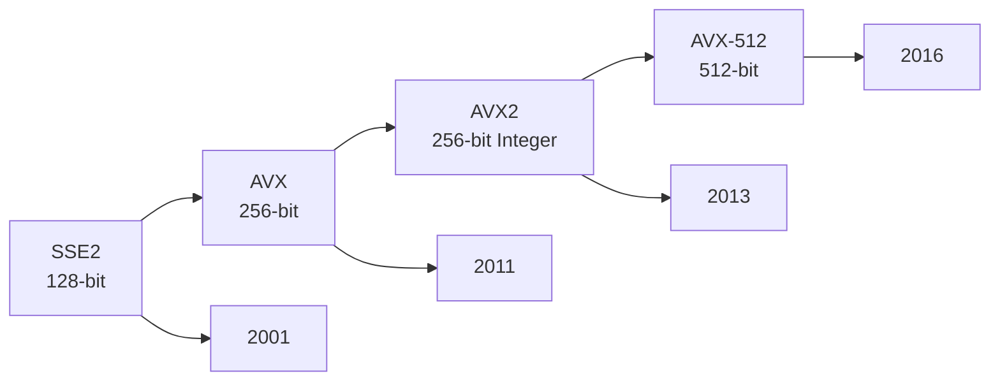
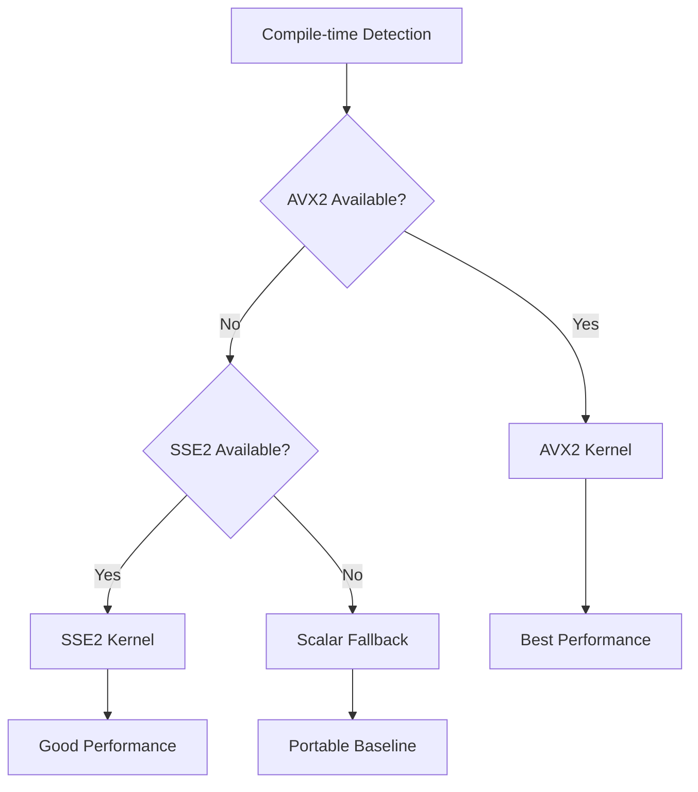

# SIMD Primer

SIMD (Single Instruction, Multiple Data) is the core source of BitCal's performance advantage.

## What is SIMD?

SIMD allows a single instruction to process multiple data elements simultaneously:

```
Scalar Processing (64 bits at a time):
┌─────────┐
│ 64 bits │ ← One instruction processes one word
└─────────┘

SIMD Processing (256 bits at a time):
┌─────────┬─────────┬─────────┬─────────┐
│ 64 bits │ 64 bits │ 64 bits │ 64 bits │ ← One instruction processes four words
└─────────┴─────────┴─────────┴─────────┘
         AVX2 256-bit register
```

## x86 SIMD Evolution



| ISA | Register Width | Integer Support | BitCal Support |
|-----|---------------|-----------------|----------------|
| SSE2 | 128-bit | ✅ | ✅ |
| AVX | 256-bit | ❌ (float only) | - |
| AVX2 | 256-bit | ✅ | ✅ Primary optimization |
| AVX-512 | 512-bit | ✅ | ✅ (fallback to AVX2) |

## BitCal's SIMD Dispatch

BitCal uses `if constexpr` to select the optimal backend at compile time:

```cpp
template <typename... Args>
auto operation(Args... args) {
    if constexpr (has_avx2_support) {
        return avx2_kernel(args...);  // AVX2 fast path
    } else if constexpr (has_sse2_support) {
        return sse2_kernel(args...);  // SSE2 fallback
    } else {
        return scalar_kernel(args...); // Scalar baseline
    }
}
```

### Dispatch Strategy



## Common SIMD Pitfalls

### Pitfall 1: AVX Shift Lane Issue

```cpp
// ❌ Wrong: _mm256_slli_si256 operates on 128-bit lanes independently
__m256i shifted = _mm256_slli_si256(data, 3);
// Result: Each 128-bit lane shifts independently, no cross-lane movement

// ✅ Correct: BitCal's two-stage strategy
// Stage 1: Cross-lane whole word movement (scalar)
// Stage 2: In-lane shift + carry propagation (SIMD)
```

### Pitfall 2: Alignment Requirements

```cpp
// ❌ May crash or degrade performance
__m256i data = _mm256_load_ps(unaligned_ptr);

// ✅ Use aligned load or allow unaligned
__m256i data = _mm256_loadu_ps(any_ptr);  // Unaligned load
__m256i data = _mm256_load_ps(aligned_ptr); // Aligned load (faster)
```

### Pitfall 3: Mixed ISA Penalty

```cpp
// ❌ AVX and SSE mixing causes penalty
__m256i avx_data = _mm256_add_ps(a, b);
__m128 sse_data = _mm_add_ps(c, d);  // Penalty!

// ✅ Keep ISA consistent
__m256i avx_data = _mm256_add_ps(a, b);
__m256i avx_data2 = _mm256_add_ps(c256, d256);  // No penalty
```

## Performance Comparison Example

Using 256-bit AND operation as example:

| Implementation | Instructions | Cycles | Notes |
|---------------|--------------|--------|-------|
| Scalar Loop | 4 | 4 | 4x 64-bit AND |
| SSE2 | 2 | 1 | 2x 128-bit AND |
| AVX2 | 1 | 0.5 | 1x 256-bit AND |

## How to Verify SIMD is in Use?

### Compile-time Check

```cpp
#include <bitcal/config.hpp>

#if BITCAL_HAS_AVX2
    std::cout << "AVX2 backend enabled\n";
#endif
```

### Runtime Check

```cpp
#include <bitcal/bitcal.hpp>

// Check alignment
bit_block<256> block;
assert(reinterpret_cast<uintptr_t>(block.view().data()) % 32 == 0);
```

## ARM NEON Support

BitCal also supports ARM NEON:

| ISA | Platform | Register Width |
|-----|----------|---------------|
| NEON | ARM64 | 128-bit |

Note: BitCal's primary optimization path is x86-64. ARM support is a portable fallback.

---

> Next: [Terminology](./terminology.md) to understand BitCal's terminology system.
