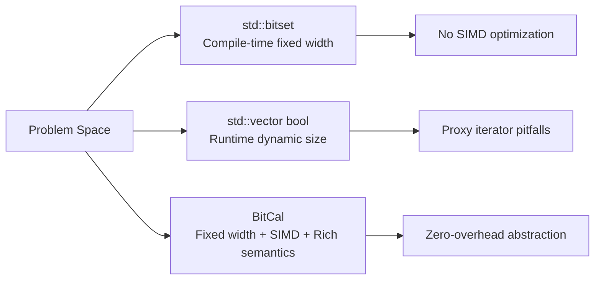

# Why BitCal

BitCal's value proposition lies in choosing a middle ground that C++ standard library ignores.

## The Problem Space

C++ standard library provides two bit manipulation abstractions:

| Abstraction | Characteristics | Limitation |
|-------------|-----------------|------------|
| `std::bitset<N>` | Compile-time fixed width | No SIMD optimization, inflexible API |
| `std::vector<bool>` | Runtime dynamic size | Proxy iterator pitfalls, no bit-operation semantics |

Neither is suitable for scenarios requiring **high performance, fixed width, and rich semantics**.

## BitCal's Choice

BitCal chose a different design point:

### Core Claims

1. **Fixed Width**: Compile-time determined size, no dynamic allocation overhead
2. **SIMD First**: Automatic dispatch to SSE2/AVX2/AVX-512/NEON
3. **Clear Semantics**: owner, view, algorithm role separation
4. **Zero Overhead**: `if constexpr` compile-time dispatch, no runtime virtual functions

## Suitable Scenarios

BitCal is suitable for:

| Scenario | Description |
|----------|-------------|
| **Bitmap Index** | Fixed-width bitmap operations |
| **Bloom Filter** | Bit-level set operations |
| **Cryptographic Primitives** | High-performance bit operations |
| **Network Protocols** | Bit-level protocol parsing |
| **Game Engines** | Entity Component System flags |

## Unsuitable Scenarios

BitCal is **not suitable** for:

| Scenario | Alternative |
|----------|-------------|
| Runtime dynamic size | `Boost.DynamicBitset` |
| Compressed bitset | `CRoaring` |
| Simple boolean flags | `std::bitset` or `bool` |

## Design Philosophy

BitCal's design follows these principles:

1. **Contract over Implementation**: Public API centers on observable behavior, not implementation details
2. **Evidence over Claims**: Performance data must be reproducible
3. **Clear Boundaries**: User code should not depend on internal headers
4. **Honest Baseline**: Don't package smoke tests as production promises

---

> If your project needs high-performance bit operations with compile-time known widths, BitCal may be the right choice. Continue reading [Bit Mental Model](./bit-mental-model.md) to learn more.
