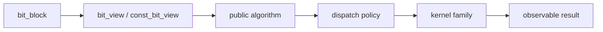

# Algorithm Design

BitCal places its main architectural bet on free algorithms. The goal is to make behavior legible without coupling every operation to one owning type.

## Free algorithm organization

Free algorithms sit between the public role model and the implementation boundary.

This organization keeps public semantics centered on inputs, outputs, and boundary conditions rather than on method placement.

## Algorithm families

The public algorithm surface is easier to review when grouped by semantics instead of by kernel implementation:

| Family | Typical question | Why the family exists |
| --- | --- | --- |
| Logical composition | How do two blocks or views combine? | Core boolean behavior is the minimum bit-library contract. |
| Shift and movement | How do bits move across word boundaries? | Shift semantics are where correctness and backend tricks often diverge. |
| Counting and inspection | What can be measured or queried from a block/view? | Counting operations turn semantic clarity into measurable evidence. |
| Construction and conversion | How does storage enter or leave the public model? | Explicit boundaries matter when ownership and borrowing are separate. |

## Observable semantics first

Public documentation should always answer these questions before mentioning acceleration strategy:

1. what inputs the algorithm accepts;
2. what result shape it returns or mutates;
3. which aliasing, width, and boundary conditions matter;
4. which guarantees are semantic versus incidental.

Only after those answers are clear should the whitepaper and performance sections discuss dispatch or x86-specific fast paths.

## Why borrowing must remain normal

Free algorithms make it natural to run the same operation over owners and views. That matters because BitCal is trying to make borrowed access a first-class citizen instead of a secondary convenience layer.

If the algorithm layer were centered on methods of an owning type, views would constantly look like adapters. The free-algorithm model avoids that hierarchy.
