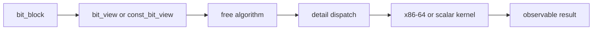

# Algorithm Design

The algorithm layer is where BitCal makes its strongest architectural choice: behavior should be described in terms of operations over blocks and views, not in terms of an all-purpose object carrying every concern at once.

## Flow of responsibility

## Why free algorithms are the center

### 1. They keep the contract behavioral

Readers can ask: *what result does this algorithm guarantee*, rather than *which class owns the implementation detail*.

### 2. They make borrowing normal

Borrowed access stops being an afterthought when algorithms can operate on views as naturally as on owners.

### 3. They keep backend talk behind the curtain

BitCal still wants implementation freedom. Free algorithms let the library evolve dispatch and kernel policy without making those decisions part of the naming surface.

## Design pressure this creates

The algorithm layer must stay disciplined:

- operations need clear ownership and aliasing expectations
- documentation must state behavior before optimization rationale
- benchmark pages must explain which algorithm shapes are being measured

## Reader takeaway

If you understand the owner/view split and the algorithm surface, you understand the public logic of BitCal. The rest is implementation freedom, not public identity.
