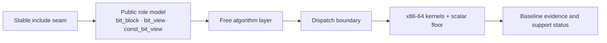

# Whitepaper

The whitepaper is where BitCal states the redesign thesis clearly enough to be challenged. It is organized around one architectural spine instead of around feature lists.

## System architecture spine

The whitepaper therefore answers three questions in sequence: what the public model is, how algorithms are organized, and where the contract stops so dispatch and kernels may evolve.

## Public model

Start with the [public model page](/en/whitepaper/public-model). It explains why BitCal treats owner, view, and algorithm as distinct public roles instead of as methods hanging from a single object.

## Algorithm organization

Continue with [algorithm design](/en/whitepaper/algorithm-design). That page explains why free algorithms are the behavioral center, how algorithm families are grouped, and why observable semantics come before backend discussion.

## Dispatch and support boundary

Finish the thesis layer with [dispatch and kernels](/en/whitepaper/dispatch-and-kernels). That page defines what belongs above the contract line, what remains implementation freedom, and how the x86-64-first support posture constrains documentation.

<ReadingPathGrid
  :items="[
    {
      title: 'Public Model',
      href: '/en/whitepaper/public-model',
      badge: 'Role model',
      tone: 'whitepaper',
      summary: 'Owner, view, algorithm, and the stable include seam.',
      detail: 'Read this first if you need to know what the public vocabulary actually is.'
    },
    {
      title: 'Algorithm Design',
      href: '/en/whitepaper/algorithm-design',
      badge: 'Behavior',
      tone: 'whitepaper',
      summary: 'How free algorithms organize the contract surface.',
      detail: 'This page explains family structure, semantics-first wording, and why borrowing is first-class.'
    },
    {
      title: 'Dispatch and Kernels',
      href: '/en/whitepaper/dispatch-and-kernels',
      badge: 'Boundary',
      tone: 'whitepaper',
      summary: 'Where implementation freedom begins and support claims narrow.',
      detail: 'Readers should understand this boundary before reading performance numbers.'
    },
    {
      title: 'Performance',
      href: '/en/performance/',
      badge: 'Evidence hand-off',
      summary: 'Leave the thesis layer and inspect the retained baseline and methodology.',
      detail: 'The whitepaper intentionally hands off to performance rather than embedding benchmark claims inside architecture prose, and ARM rows stay blank until retained benchmark evidence exists.'
    }
  ]"
/>
