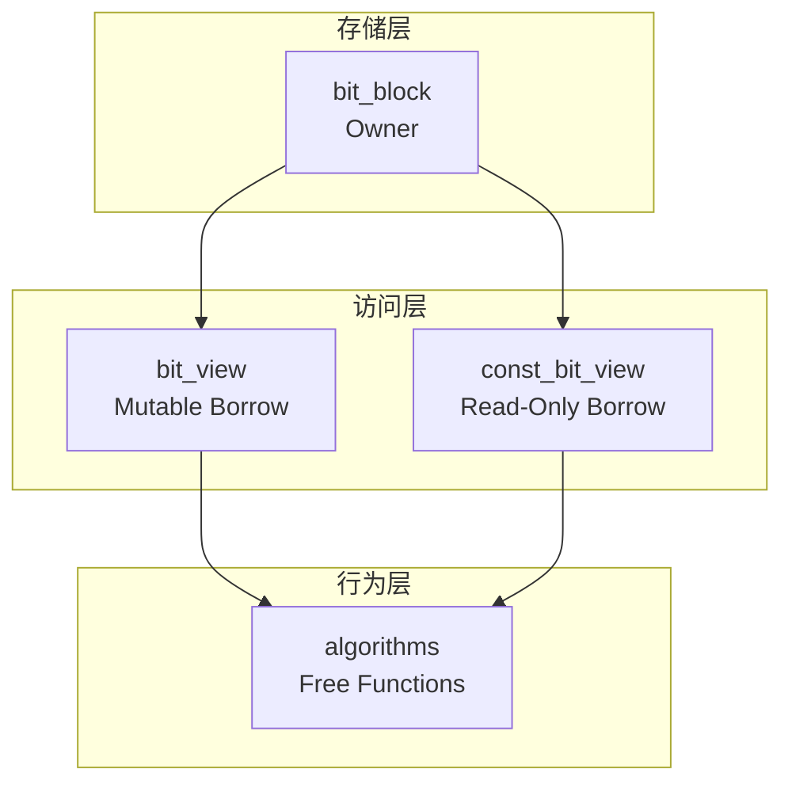

# 位运算心智模型

理解 BitCal 需要先建立正确的位运算心智模型。

## 内存视角

在计算机内存中，位是以**字（word）**为单位组织的。BitCal 使用 64 位字作为基础单位：

```
┌──────────────────────────────────────────────────────────────────┐
│                         64-bit Word                               │
├──┬──┬──┬──┬──┬──┬──┬──┬──┬──┬──┬──┬──┬──┬──┬──┬──┬──┬──┬──┬──┬──┤
│63│62│61│60│59│58│57│56│55│54│53│52│51│50│49│48│...│ 3│ 2│ 1│ 0│
└──┴──┴──┴──┴──┴──┴──┴──┴──┴──┴──┴──┴──┴──┴──┴──┴──┴──┴──┴──┴──┴──┘
│<──────────────────────── 小端序：低位在低地址 ──────────────────────>│
```

### 小端序

BitCal 遵循小端序约定：
- 位 0 是最低有效位（LSB）
- 位 63 是最高有效位（MSB）
- 字 0 存储在最低内存地址

## 位宽选择

BitCal 支持以下固定位宽：

| 类型 | 位宽 | 字数 | 典型用途 |
|------|------|------|---------|
| `bit_block<64>` | 64 | 1 | 标量运算 |
| `bit_block<128>` | 128 | 2 | SSE/SIMD |
| `bit_block<256>` | 256 | 4 | AVX2 |
| `bit_block<512>` | 512 | 8 | AVX-512 |
| `bit_block<1024>` | 1024 | 16 | 大位图 |

## 操作分类

位运算可以分为以下类别：

### 逐位逻辑运算

```cpp
// AND：两个位都为 1 时结果为 1
result = a & b;

// OR：任一位为 1 时结果为 1
result = a | b;

// XOR：两位不同时结果为 1
result = a ^ b;

// NOT：位取反
result = ~a;
```

### 移位运算

```cpp
// 左移：高位丢弃，低位补 0
result = a << n;

// 右移：低位丢弃，高位补 0（逻辑右移）
result = a >> n;
```

### 位计数运算

```cpp
// popcount：统计 1 的个数
count = popcount(a);

// CLZ（Count Leading Zeros）：统计前导零
zeros = clz(a);

// CTZ（Count Trailing Zeros）：统计尾随零
zeros = ctz(a);
```

## 三角色模型

BitCal 的核心心智模型是 **owner、view、algorithm** 三角色分离：



### 为什么分离？

1. **所有权清晰**：`bit_block` 拥有存储，`bit_view` 只是借用
2. **零拷贝操作**：算法可以直接操作已有存储
3. **契约稳定**：公共 API 围绕可观察行为，而非实现细节

## 性能直觉

理解 SIMD 性能需要建立以下直觉：

### 标量 vs SIMD

| 操作 | 标量周期 | AVX2 周期 | 加速比 |
|------|---------|----------|-------|
| 256-bit AND | 4 | 1 | 4x |
| 256-bit popcount | ~24 | ~3 | 8x |

### 对齐的重要性

```
未对齐（性能下降）：
地址: 0x1001 (非 32 字节对齐)
├── 加载需要两条指令
└── 可能跨越缓存行边界

对齐（最佳性能）：
地址: 0x1000 (32 字节对齐)
├── 单条 VMOVAPS 指令
└── 单周期完成
```

BitCal 的 `bit_block` 默认使用 32 字节对齐（x86-64），确保 SIMD 操作的最佳性能。

---

> 下一章：[SIMD 入门](./simd-primer.md) 了解 SIMD 优化的具体实现。
