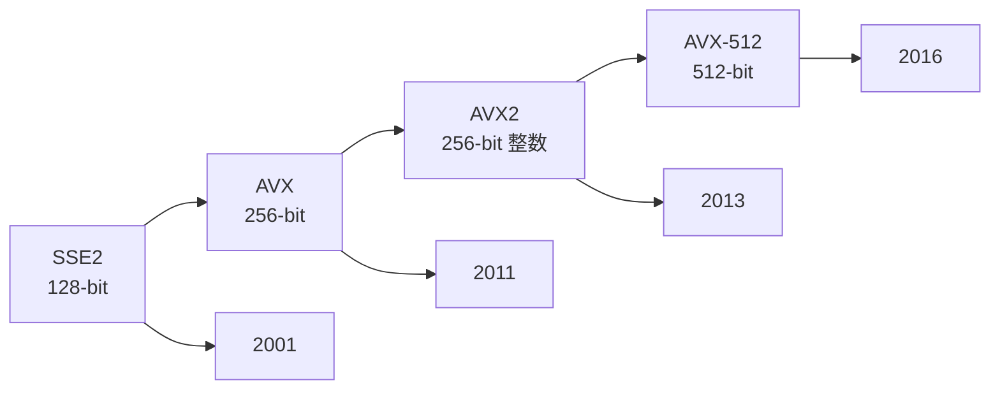
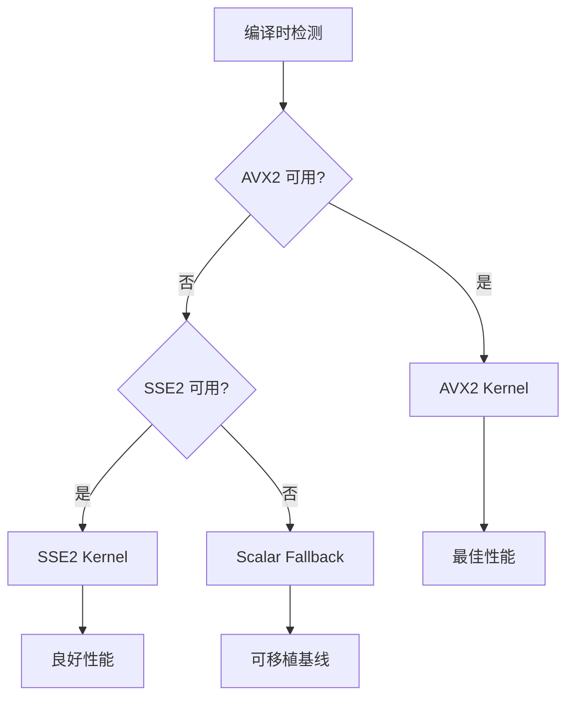

# SIMD 入门

SIMD（Single Instruction, Multiple Data）是 BitCal 性能优势的核心来源。

## 什么是 SIMD？

SIMD 允许一条指令同时处理多个数据元素：

```
标量处理（一次处理 64 位）：
┌─────────┐
│ 64 bits │ ← 一条指令处理一个字
└─────────┘

SIMD 处理（一次处理 256 位）：
┌─────────┬─────────┬─────────┬─────────┐
│ 64 bits │ 64 bits │ 64 bits │ 64 bits │ ← 一条指令处理四个字
└─────────┴─────────┴─────────┴─────────┘
         AVX2 256-bit 寄存器
```

## x86 SIMD 演进



| ISA | 寄存器宽度 | 整数支持 | BitCal 支持 |
|-----|-----------|---------|------------|
| SSE2 | 128-bit | ✅ | ✅ |
| AVX | 256-bit | ❌（仅浮点） | - |
| AVX2 | 256-bit | ✅ | ✅ 主要优化 |
| AVX-512 | 512-bit | ✅ | ✅（回退到 AVX2） |

## BitCal 的 SIMD 分发

BitCal 使用 `if constexpr` 在编译时选择最佳后端：

```cpp
template <typename... Args>
auto operation(Args... args) {
    if constexpr (has_avx2_support) {
        return avx2_kernel(args...);  // AVX2 快路径
    } else if constexpr (has_sse2_support) {
        return sse2_kernel(args...);  // SSE2 备选
    } else {
        return scalar_kernel(args...); // 标量兜底
    }
}
```

### 分发策略



## 常见 SIMD 陷阱

### 陷阱 1：AVX 移位的通道问题

```cpp
// ❌ 错误：_mm256_slli_si256 独立操作 128 位通道
__m256i shifted = _mm256_slli_si256(data, 3);
// 结果：每个 128 位通道独立移位，不会跨通道

// ✅ 正确：BitCal 的两阶段策略
// 阶段 1：跨通道移动整字（标量）
// 阶段 2：通道内移位 + 进位传播（SIMD）
```

### 陷阱 2：对齐要求

```cpp
// ❌ 可能崩溃或性能下降
__m256i data = _mm256_load_ps(unaligned_ptr);

// ✅ 使用对齐加载或允许未对齐
__m256i data = _mm256_loadu_ps(any_ptr);  // 未对齐加载
__m256i data = _mm256_load_ps(aligned_ptr); // 对齐加载（更快）
```

### 陷阱 3：混合 ISA 惩罚

```cpp
// ❌ AVX 和 SSE 混用导致惩罚
__m256i avx_data = _mm256_add_ps(a, b);
__m128 sse_data = _mm_add_ps(c, d);  // 惩罚！

// ✅ 保持 ISA 一致
__m256i avx_data = _mm256_add_ps(a, b);
__m256i avx_data2 = _mm256_add_ps(c256, d256);  // 无惩罚
```

## 性能对比示例

以 256 位 AND 操作为例：

| 实现方式 | 指令数 | 周期数 | 说明 |
|---------|-------|-------|------|
| 标量循环 | 4 | 4 | 4 次 64-bit AND |
| SSE2 | 2 | 1 | 2 次 128-bit AND |
| AVX2 | 1 | 0.5 | 1 次 256-bit AND |

## 如何验证 SIMD 正在使用？

### 编译时检查

```cpp
#include <bitcal/config.hpp>

#if BITCAL_HAS_AVX2
    std::cout << "AVX2 后端已启用\n";
#endif
```

### 运行时检查

```cpp
#include <bitcal/bitcal.hpp>

// 检查对齐
bit_block<256> block;
assert(reinterpret_cast<uintptr_t>(block.view().data()) % 32 == 0);
```

## ARM NEON 支持

BitCal 也支持 ARM NEON：

| ISA | 平台 | 寄存器宽度 |
|-----|------|-----------|
| NEON | ARM64 | 128-bit |

注意：BitCal 的主要优化路径是 x86-64。ARM 支持作为可移植后备。

---

> 下一章：[术语表](./terminology.md) 了解 BitCal 的术语体系。
