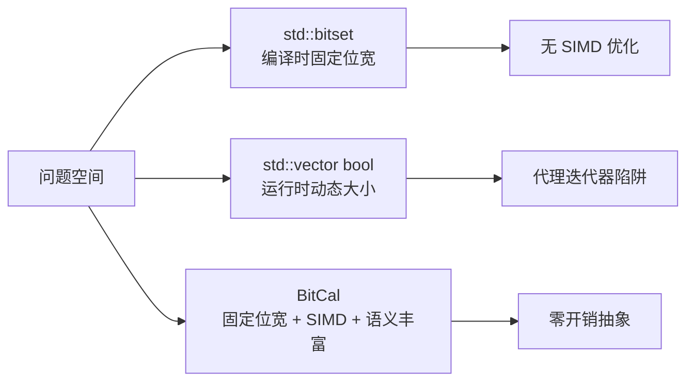

# 为什么选择 BitCal

BitCal 存在的价值，在于它选择了一个被 C++ 标准库忽略的中间地带。

## 问题空间

C++ 标准库提供了两种位操作抽象：

| 抽象 | 特点 | 局限 |
|------|------|------|
| `std::bitset<N>` | 编译时固定位宽 | 无 SIMD 优化、API 不灵活 |
| `std::vector<bool>` | 运行时动态大小 | 代理迭代器陷阱、无位运算语义 |

两者都不适合需要**高性能、固定位宽、丰富语义**的场景。

## BitCal 的选择

BitCal 选择了一个不同的设计点：

### 核心主张

1. **固定位宽**：编译时确定大小，无动态分配开销
2. **SIMD 优先**：自动分发到 SSE2/AVX2/AVX-512/NEON
3. **语义清晰**：owner、view、algorithm 三角色分离
4. **零开销**：`if constexpr` 编译时分发，无运行时虚函数

## 适用场景

BitCal 适合以下场景：

| 场景 | 说明 |
|------|------|
| **位图索引** | 固定位宽的位图操作 |
| **布隆过滤器** | 位级集合运算 |
| **密码学原语** | 高性能位运算 |
| **网络协议** | 位级协议解析 |
| **游戏引擎** | 实体组件系统标志位 |

## 不适合的场景

BitCal **不适合**以下场景：

| 场景 | 替代方案 |
|------|---------|
| 运行时动态大小 | `Boost.DynamicBitset` |
| 压缩位集 | `CRoaring` |
| 简单布尔标志 | `std::bitset` 或 `bool` |

## 设计哲学

BitCal 的设计遵循以下原则：

1. **契约优于实现**：公开 API 围绕可观察行为，而非实现细节
2. **证据优先于宣称**：性能数据必须可复现
3. **边界清晰**：用户代码不应依赖内部头文件
4. **诚实基线**：不把 smoke 测试包装成成品承诺

---

> 如果你的项目需要高性能位操作，且位宽在编译时已知，BitCal 可能是合适的选择。继续阅读 [位运算心智模型](./bit-mental-model.md) 了解更多。
