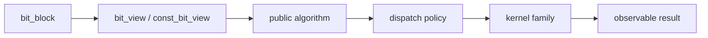

# 算法设计

BitCal 在架构上最关键的一笔，是把自由算法放到中心位置。目标不是“看起来更现代”，而是让行为能够被清楚阅读，而不必依附在某个 owning type 上。

## 自由算法组织

自由算法位于公开角色模型与实现边界之间。

这种组织方式让公开语义围绕输入、输出和边界条件展开，而不是围绕“这个成员函数挂在哪个类上”展开。

## 算法族

当算法按语义而不是按 kernel 实现来组织时，读者更容易建立清晰模型：

| 算法族 | 读者会问什么 | 为什么这样分组 |
| --- | --- | --- |
| 逻辑组合 | 两个 block 或 view 如何组合？ | 逐位逻辑是位库最基础的行为契约。 |
| 移位与搬运 | 位如何跨 word 边界移动？ | 移位往往最容易暴露 correctness 与 backend 技巧的张力。 |
| 计数与观察 | 能从 block/view 中量出什么信息？ | 计数类操作最容易把语义清晰度转成可测证据。 |
| 构造与转换 | 数据如何进入或离开公开模型？ | ownership 与 borrowing 分开后，边界更值得被写明。 |

## 先定义可观察语义

任何公开算法页面，都应先回答四个问题，再谈加速路径：

1. 接受什么输入；
2. 返回或修改什么结果；
3. 哪些 aliasing、位宽与边界条件会影响语义；
4. 哪些保证是契约，哪些只是当前实现副产物。

只有这些问题先被讲清楚，白皮书与性能页才有资格继续讨论 dispatch 或 x86 细节。

## 为什么 borrowing 必须是常态

自由算法的另一个价值，是让 owner 与 view 都能自然地成为同一操作的输入。BitCal 不希望 borrowed access 永远像一个附属适配层。

如果算法仍然围绕 owning type 的成员函数组织，view 看起来就会一直像补丁；自由算法模型正是在避免这种等级结构。
